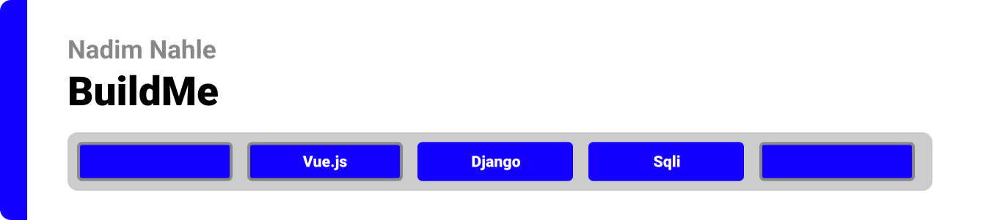
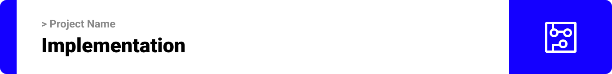

> Hello world! This is the project’s summary that describes the project plain and simple, limited to the space available. 

  
**[PROJECT PHILOSOPHY](#project-philosophy) • [WIREFRAMES](#wireframes) • [TECH STACK](#tech-stack) • [IMPLEMENTATION](#implementation) • [HOW TO RUN?](#how-to-run)**

  

> LeVehicles is an ecommerce wevsite to buy cars and motrcycles. 

### Normal user Stories
- As a user, I can check check prducts accroding to category.
- As a user, I can check search for any product.
- As a user, I can add products to card.

### Admin user Stories
- As an admin, I can check and edit registered users.
- As an admin, I can add edit items.
- As an admin, I can add and edit categories.

  

Here's a brief high-level overview of the tech stack the Well app uses:

- This project uses the [Vuejs Library](https://vuejs.org/).Vue.js is an open-source model–view–viewmodel front end JavaScript framework for building user interfaces and single-page applications.

- The server side of the project is build using the [Django Framework](https://www.djangoproject.com/).

- For database, the app uses the [SQLite database](https://www.sqlite.org/index.html). SQLite is a C-language library that implements a small, fast, self-contained, high-reliability, full-featured, SQL database engine.

  

Using the above mentioned tech stacks and the wireframes build with figma from the user sotries we have, the implementation of the app is shown as below, these are screenshots from the real app

| Cars  | Motorcycles  |
| -----------------| -----|
|  | 

| Login | Checkout  |
| -----------------| -----|
|  | 

| Orders | Registers  |
| -----------------| -----|
|  | 

| Account | Add To Card  |
| -----------------| -----|
|  | 

| Admin Login | Add Categories |
| -----------------| -----|
|  | 

| Users | Stripe Payment |
| -----------------| -----|
|  | 

